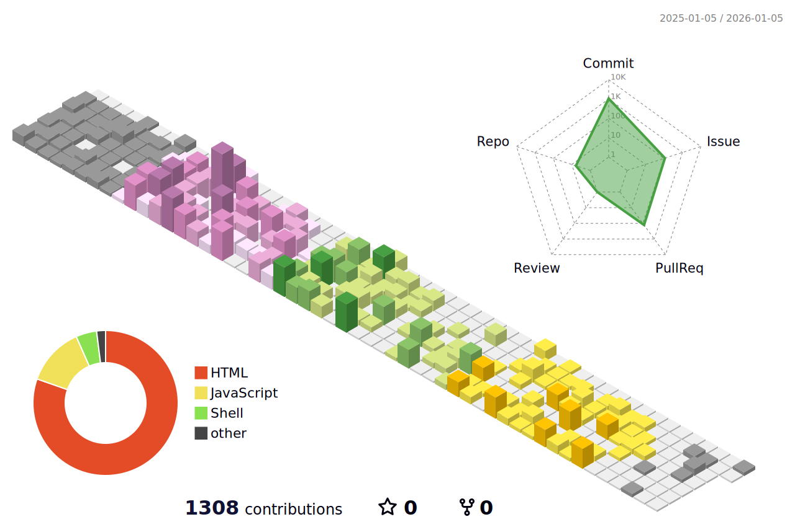

  
### Hi there 👋 I'm ritananashi
Love : 🎮 🍵 🖋️  
Runteq（2024/9/4～2025/6/4） 
  
 
# My App  
|[iroGraphica](https://irographica.com/)|
| :---: |
|  |
| 万年筆・ガラスペン用インクのレビュー投稿・共有サービス。 RUNTEQ卒業制作 |
|  |
|   |

# My Status  
  
  

